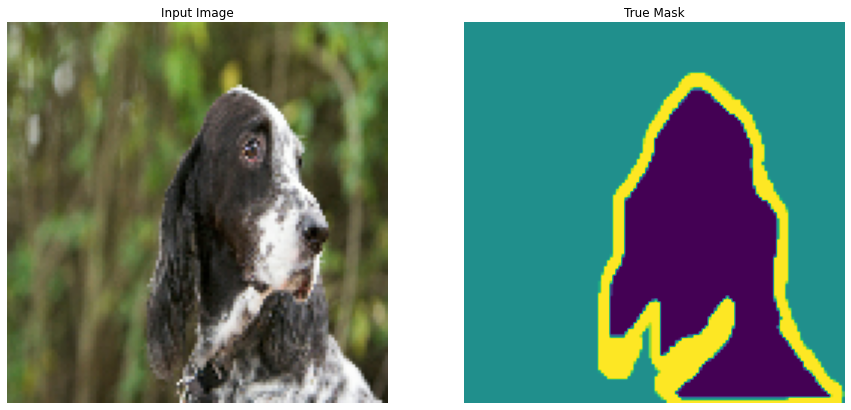

# Image-Segmentation-Uisng-Pets-Dataset
Training a Convolutional Neural Network to perform Image Segmentation on Oxford Pets Dataset

Project Structure:
* 1: Import Libraries and Download the Dataset
* 2: Preprocess Data and View Segmentation Mask
* 3: Define the model
* 4: Train the model and Visualize Results
* 5: Vizulazing Predictions

Suppose we want to know the location of an object in the image, the shape of that object, which pixel belongs to which object, etc.  
In this case you will want to segment the image, i.e., each pixel of the image is given a label. Thus, the task of image segmentation is to train a neural network to output a pixel-wise mask of the image. This helps in understanding the image at a much lower level, i.e., the pixel level. Image segmentation has many applications in medical imaging, self-driving cars and satellite imaging to name a few. 

**Overview of the data set:**  
The dataset that will be used for this poject is the [Oxford-IIIT Pet Dataset](https://www.robots.ox.ac.uk/~vgg/data/pets/), created by Parkhi *et al*. The dataset consists of images, their corresponding labels, and pixel-wise masks. The masks are basically labels for each pixel. Each pixel is given one of three categories :

*   Class 1 : Pixel belonging to the pet.
*   Class 2 : Pixel bordering the pet.
*   Class 3 : None of the above/ Surrounding pixel.

The dataset is already included in TensorFlow datasets, all that is needed to do is download it ⏬. 
(The segmentation masks are included in version 3+)
>sample image in dataset**

**MODEL**
The model being used here is a modified U-Net. 
* A U-Net consists of an encoder (downsampler) and decoder (upsampler). In-order to learn robust features, and reduce the number of trainable parameters, a pretrained model can be used as the encoder. Thus, the encoder for this task will be a pretrained MobileNetV2 model, whose intermediate outputs will be used.  
* The reason to output three channels is because there are three possible labels for each pixel.
* The down sampling Model will be the Pre Trained MobileNet and then the image will be upsampled
